# Design: Care Plan & Nudges Enhancement

## Overview

Enhance the PetCircle system across four areas: (1) harden the nudge scheduler with global communication rules, (2) add food/supplement CTA differentiation to the care plan engine, (3) introduce category-specific WhatsApp reminder message templates, and (4) build the NudgesView frontend component plus apply JSX guardrails to existing dashboard cards. All changes are brownfield — conforming to existing FastAPI + SQLAlchemy patterns on the backend and Next.js + inline styles on the frontend.

---

## Architecture

```mermaid
graph TD
    subgraph Frontend["Frontend (Next.js)"]
        DC[DashboardClient.tsx<br/>View Router]
        DV[DashboardView]
        NV["NudgesView<br/>NEW"]
        NB["NudgeBanner<br/>NEW"]
        HCC[HealthConditionsCard<br/>MODIFY]
        LSC[LifeStageCard<br/>MODIFY]
        CPC[CarePlanCard<br/>MODIFY]
        DAC[DietAnalysisCard<br/>VERIFY]
        HTV[HealthTrendsView]
        AVS[AskVetSection<br/>MODIFY]
        SS[SignalsSection<br/>MODIFY]
        CCS[CareCadenceSection<br/>MODIFY]
        RV[RecordsView<br/>MODIFY]

        DC --> DV
        DC -->|NEW view state| NV
        DV --> NB
        DV --> HCC
        DV --> LSC
        DV --> CPC
        DV --> DAC
        NB -->|navigate| NV
        HTV --> AVS
        HTV --> SS
        HTV --> CCS
    end

    subgraph Backend["Backend (FastAPI)"]
        DR[dashboard.py router]
        NS["nudge_scheduler.py<br/>MODIFY"]
        CPE["care_plan_engine.py<br/>MODIFY"]
        RE["reminder_engine.py<br/>MODIFY"]
        RT["reminder_templates.py<br/>NEW"]
        CON["core/constants.py<br/>MODIFY"]
    end

    subgraph Data["Supabase PostgreSQL"]
        NDL[(nudge_delivery_log)]
        REM[(reminders)]
        ML[(message_logs)]
        ORD[(orders)]
        DI[(diet_items)]
    end

    DC -->|GET /nudges| DR
    DC -->|PATCH /nudges/:id/dismiss| DR
    NS -->|query 7-day window| NDL
    NS -->|query last activity| ML
    NS -->|check today reminders| REM
    CPE -->|query order history| ORD
    CPE -->|query diet items| DI
    RE -->|lookup template| RT
```



---

## Components and Interfaces

### Backend Changes

#### 1. `nudge_scheduler.py` (MODIFY)

Add three new guard functions to `run_nudge_scheduler()`:

```python
# New guard: 7-day frequency cap
def _count_nudges_in_window(db: Session, user_id: UUID, days: int = 7) -> int:
    """Count nudge deliveries for user in the last N days."""
    cutoff = datetime.utcnow() - timedelta(days=days)
    return db.query(NudgeDeliveryLog).filter(
        NudgeDeliveryLog.user_id == user_id,
        NudgeDeliveryLog.sent_at >= cutoff,
        NudgeDeliveryLog.wa_status == "sent",
    ).count()

# New guard: same-day reminder conflict (scheduled reminders too)
def _has_reminder_scheduled_today(db: Session, user_id: UUID, today: date) -> bool:
    """Check if any reminder is scheduled to send today for this user's pets."""
    pet_ids = [p.id for p in db.query(Pet.id).filter(
        Pet.user_id == user_id, Pet.is_deleted == False
    ).all()]
    if not pet_ids:
        return False
    return db.query(Reminder).filter(
        Reminder.pet_id.in_(pet_ids),
        Reminder.next_due_date == today,
        Reminder.status.in_(["pending", "sent"]),
    ).first() is not None

# New trigger: 72hr inactivity
def _check_inactivity_trigger(db: Session, user_id: UUID) -> bool:
    """Return True if user has had no engagement for 72+ hours."""
    cutoff = datetime.utcnow() - timedelta(hours=NUDGE_INACTIVITY_TRIGGER_HOURS)
    last_activity = db.query(func.max(MessageLog.created_at)).filter(
        MessageLog.user_id == user_id,
    ).scalar()
    return last_activity is None or last_activity < cutoff
```

**Integration into main loop** (after existing guards at line ~109):

```python
# --- Guard: 7-day frequency cap ---
if _count_nudges_in_window(db, user.id) >= NUDGE_MAX_PER_WEEK:
    skipped += 1
    continue

# --- Guard: reminder scheduled today (not just sent) ---
if _has_reminder_scheduled_today(db, user.id, today):
    skipped += 1
    continue
```

**Inactivity trigger** — added as an alternative entry into the message selection logic. If the O+N schedule says "not today", but `_check_inactivity_trigger()` returns True and all other guards pass, the scheduler selects a nudge anyway (using the next undelivered slot message).

#### 2. `care_plan_engine.py` (MODIFY)

Modify the orderable food/supplement block (~line 881-904) to add `cta_label` and conditional `status_tag`:

```python
# After line 893: tt = "supplement" if diet_item.type == "supplement" else "food"
# Query order history for this pet + item
from app.models.order import Order, OrderItem
has_prior_order = db.query(OrderItem).join(Order).filter(
    Order.pet_id == pet.id,
    OrderItem.product_name.ilike(f"%{diet_item.label}%"),
    Order.status.in_(["delivered", "confirmed", "placed"]),
).first() is not None

# Estimate supply remaining (if order data available)
supply_low = False
if has_prior_order:
    last_order = db.query(Order).filter(
        Order.pet_id == pet.id, Order.status == "delivered"
    ).order_by(Order.created_at.desc()).first()
    if last_order and last_order.created_at:
        days_since = (date.today() - last_order.created_at.date()).days
        # Rough estimate: 30-day supply cycle
        supply_low = days_since >= 23  # 7 days before expected reorder

cta_label = "Reorder" if has_prior_order else "Order Now"
status_tag = "Due Soon" if supply_low else "Active"

continue_items[item_key] = {
    "name": diet_item.label,
    "test_type": tt,
    "freq": "Daily",
    "next_due": None,
    "status_tag": status_tag,
    "classification": Classification.PERIODIC.value,
    "reason": None,
    "orderable": True,
    "cta_label": cta_label,
}
```

#### 3. `reminder_templates.py` (NEW)

A pure-data module providing a template registry. No database dependency — templates are code constants.

```python
"""
PetCircle — Reminder Message Templates

11 categories x 4 stages = 44 template entries.
Each entry: (message_body, cta_buttons).
Variables use [Name], [Pet], etc. — substituted at send time.
"""

from dataclasses import dataclass

@dataclass(frozen=True)
class ReminderTemplate:
    body: str
    ctas: list[str]

# Registry: (category, sub_type, stage) -> ReminderTemplate
REMINDER_TEMPLATES: dict[tuple[str, str | None, str], ReminderTemplate] = {
    # ── Vaccines (First Time) ──
    ("vaccine", "first_time", "t7"): ReminderTemplate(
        body="Hi [Name] 🐾 [Pet]'s first vaccinations are coming up on [date]...",
        ctas=["Remind Me Later", "Already Done — Log It"],
    ),
    ("vaccine", "first_time", "due"): ReminderTemplate(
        body="[Name], time for [Pet]'s vaccinations today 🐾 ...",
        ctas=["Done — Log It", "Remind Me Later", "Schedule For"],
    ),
    # ... (all 44 entries from Nudges Excel Reminders sheet)

    # ── Hygiene (due-only) ──
    ("hygiene", None, "due"): ReminderTemplate(
        body="Hi [Name] 🐾 Monthly care day for [Pet]...",
        ctas=["Done — Log It", "Remind Me Later", "Schedule For"],
    ),
}

def get_reminder_template(
    category: str, stage: str, sub_type: str | None = None
) -> ReminderTemplate | None:
    """Look up the template for a (category, sub_type, stage) combination."""
    return REMINDER_TEMPLATES.get((category, sub_type, stage))

def substitute_variables(body: str, variables: dict[str, str]) -> str:
    """Replace [Name], [Pet], etc. with actual values."""
    result = body
    for key, value in variables.items():
        result = result.replace(f"[{key}]", value)
    return result
```

#### 4. `reminder_engine.py` (MODIFY)

Update `_build_template_params()` to use the new template registry for category-specific messages. The existing fallback to generic templates (settings.WHATSAPP_TEMPLATE_REMINDER_T7, etc.) remains as a safety net.

```python
from app.services.reminder_templates import get_reminder_template, substitute_variables

def _build_template_params(cand, settings, db):
    # Try category-specific template first
    template = get_reminder_template(cand.category, cand.stage, cand.sub_type)
    if template:
        variables = _build_variable_dict(cand, db)
        message_body = substitute_variables(template.body, variables)
        # Return WA template name + params (body goes into {{1}})
        wa_template = _wa_template_for_stage(cand.stage, settings)
        return wa_template, [message_body]

    # Fallback to existing generic templates
    # ... (existing logic unchanged)
```

#### 5. `core/constants.py` (MODIFY)

Add new constants:

```python
NUDGE_MAX_PER_WEEK = 2
NUDGE_INACTIVITY_TRIGGER_HOURS = 72
```

---

### Frontend Changes

#### 6. `NudgesView.tsx` (NEW)

```
frontend/src/components/nudges/
  NudgesView.tsx    — Main view with category grouping
  NudgeCard.tsx     — Individual nudge card
```

**NudgesView** receives: `token: string`, `onBack: () => void`, `onAddToCart: (item) => void`

- Calls `getNudges(token)` on mount
- Groups nudges by category (7 groups, ordered: vaccine → checkup)
- Renders category headers with icons
- Passes each nudge to NudgeCard
- Shows empty state when no nudges
- Shows loading spinner during fetch
- Home floater button at bottom-right

**NudgeCard** receives: `nudge: NudgeItem`, `onDismiss: (id) => void`, `onOrder: (nudge) => void`

- Icon + title row with priority badge
- Message body (truncated at 3 lines with "Show more" toggle)
- Dismiss button (with confirmation dialog) — hidden for mandatory nudges
- "Order Now" button for orderable nudges — green "Added" animation (1.8s)

#### 7. `NudgeBanner.tsx` (NEW)

```
frontend/src/components/dashboard/NudgeBanner.tsx
```

Compact card rendered between HealthConditionsCard and CarePlanCard:

```tsx
// Props: { count: number; petName: string; onViewAll: () => void }
// Renders nothing when count === 0
<div className="card" style={{ background: "var(--to)", border: "1px solid var(--orange)33" }}>
  <div style={{ display: "flex", alignItems: "center", justifyContent: "space-between" }}>
    <div>
      <div style={{ fontSize: 13, fontWeight: 700 }}>You have {count} action items</div>
      <div style={{ fontSize: 11, color: "var(--t3)" }}>for {petName}</div>
    </div>
    <button className="order-btn">View All →</button>
  </div>
</div>
```

#### 8. `DashboardClient.tsx` (MODIFY)

- Add `"nudges"` to ViewState type union
- Add state: `nudgeCount: number` (fetched on dashboard load alongside main data)
- Add `renderNudgesView()` case in the view switch
- Pass `nudgeCount` and `onGoToNudges` to DashboardView
- On return from nudges view, refetch nudge count

#### 9. Dashboard Card Guardrail Modifications

**HealthConditionsCard.tsx:**
- Update `normalizeConditions()` in dashboard-utils.ts to sort by severity (red > yellow > green) then recency (most recent `diagnosed_at` first)
- Add `isPuppy` prop (derived from `data.life_stage.stage === "puppy"`)
- When puppy: query overdue preventive items from `data.preventive_summary` and render as pseudo-condition entries
- When adult/senior: only include preventive gaps if they have documented health impact

**LifeStageCard.tsx:**
- Add trait ordering: sort by `trait.category` where behavior/energy = 0, appetite/physiology = 1, clinical = 2
- Add CSS `maxHeight: "52px"` (2 lines at 12px font + 4px gap + 8px padding) with `overflow: "hidden"` on traits container

**CarePlanCard.tsx:**
- Read `item.cta_label` for button text (fallback "Order Now")
- Render amber `s-tag-y` badge when `item.status_tag === "Due Soon"`

**DietAnalysisCard.tsx:**
- Verify existing `macroStatus()` thresholds match spec (calories >100% = amber, others >110% = amber, <80% = red)

**AskVetSection.tsx:**
- Cap questions to 2 per condition with `.slice(0, 2)`, show "1 more question" overflow text if truncated

**SignalsSection.tsx:**
- Verify render order: blood panel → metabolic → weight (weight always last)

**CareCadenceSection.tsx:**
- Verify order: vaccination → tick & flea → deworming

**RecordsView.tsx + VetVisitCard.tsx:**
- Verify tab order: Vet Visits, Lab Reports, Imaging, WhatsApp
- Verify latest vet visit expanded by default, others collapsed

---

## Data Models

No new tables required. All models already exist:
- `nudge_delivery_log` — used for 7-day window query
- `reminders` — used for same-day conflict check
- `message_logs` — used for 72hr inactivity check
- `orders` / `order_items` — used for food/supplement reorder detection
- `nudges` — used by dashboard nudge endpoint (unchanged)

### ADR-1: Reminder Templates as Code vs. Database

**Status:** Accepted  
**Context:** The 44 reminder templates need to live somewhere. Options: DB table (editable at runtime) or Python code module (versioned, type-safe).  
**Options:**
- Option A: DB table — Pro: runtime editable. Con: requires migration, admin UI, no type safety.
- Option B: Python code module — Pro: versioned with code, type-safe, no migration. Con: requires deploy to change text.  
**Decision:** Option B — Python code module (`reminder_templates.py`). Templates are approval-gated business content that should be version-controlled. WhatsApp template *names* remain in env vars; only the message body text is in code.  
**Consequences:** Template text changes require a code deploy. Acceptable for Phase 1.

### ADR-2: Nudge Frequency Cap — Rolling Window vs. Calendar Week

**Status:** Accepted  
**Context:** The spec says "Max 2 messages in any 7-day window." This could mean a rolling 7-day window or a fixed Mon-Sun calendar week.  
**Options:**
- Option A: Rolling 7-day window — Pro: simpler, no edge cases at week boundaries. Con: slightly more expensive query.
- Option B: Calendar week — Pro: predictable. Con: edge cases (Sunday night + Monday morning = 2 nudges in 12 hours).  
**Decision:** Option A — Rolling 7-day window. Query `nudge_delivery_log WHERE sent_at >= now() - 7 days`.  
**Consequences:** A user could receive nudges on Day 1 and Day 6, then wait until Day 8 for the next. This is the intended behavior.

---

## API Design

No new endpoints needed. All endpoints already exist:

| Method | Endpoint | Change |
|--------|----------|--------|
| `GET /{token}` | Dashboard data | `CarePlanItem` gains optional `cta_label` field |
| `GET /{token}/nudges` | Nudge list | No change |
| `PATCH /{token}/nudges/{id}/dismiss` | Dismiss nudge | No change |

### API Response Change — `CarePlanItem`

```typescript
// frontend/src/lib/api.ts — add to existing CarePlanItem interface
export interface CarePlanItem {
  name: string;
  test_type: string;
  icon?: string;
  price?: number;
  freq: string;
  next_due: string | null;
  status_tag: string;
  orderable: boolean;
  reason: string | null;
  cta_label?: string;  // NEW — "Order Now" | "Reorder"
}
```

---

## Error Handling Strategy

- **Nudge scheduler guards:** If any guard query fails, log the error and skip the user (do not crash the entire scheduler run). Existing pattern from line ~87.
- **Care plan CTA:** If order history query fails, fall back to `cta_label: "Order Now"` and `status_tag: "Active"` (existing behavior). Wrapped in try/except matching existing pattern at line ~905.
- **Reminder templates:** If template lookup returns None, fall back to existing generic template. The `_build_template_params()` function already handles this with its existing fallback path.
- **NudgesView:** If `getNudges()` fails, show error state with retry button (matching DashboardClient error pattern).

---

## Testing Strategy

### Backend
- **Unit tests** for `_count_nudges_in_window()`, `_has_reminder_scheduled_today()`, `_check_inactivity_trigger()` — mock DB queries
- **Unit tests** for care plan CTA logic — mock order history scenarios (no orders, old order, recent order)
- **Unit tests** for `get_reminder_template()` and `substitute_variables()` — pure function tests
- **Integration test** for `run_nudge_scheduler()` — verify 7-day cap blocks when 2 nudges exist in window

### Frontend
- **Build verification** — `npm run build` must pass with zero errors after all changes
- **Type check** — no TypeScript errors from new `cta_label` field
- **Visual testing** — manual check at 430px viewport for all modified cards

---

## Security Architecture

No new security concerns. All endpoints remain token-authenticated. No new user inputs are accepted (nudge dismissal already exists). Reminder template text is hardcoded in code — no injection vector.

---

## Dependencies and Risks

| Risk | Likelihood | Impact | Mitigation |
|------|-----------|--------|------------|
| Order history query slows care plan API | Low | Medium | Wrap in try/except with fallback; add DB index if needed |
| 72hr inactivity trigger over-nudges returning users | Low | Medium | Respects 7-day cap as outer guard |
| Reminder template text doesn't match Meta-approved WA templates | Medium | High | Templates reference WA template *names* from env vars; body text is for `message_body` column logging, not the actual WA template content |
| NudgesView adds load time to dashboard | Low | Low | Nudges fetched lazily (only when navigating to NudgesView), not on dashboard load. Only count is fetched on dashboard load. |
