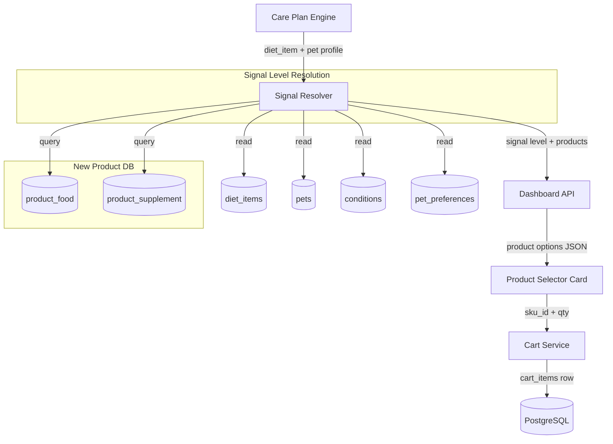
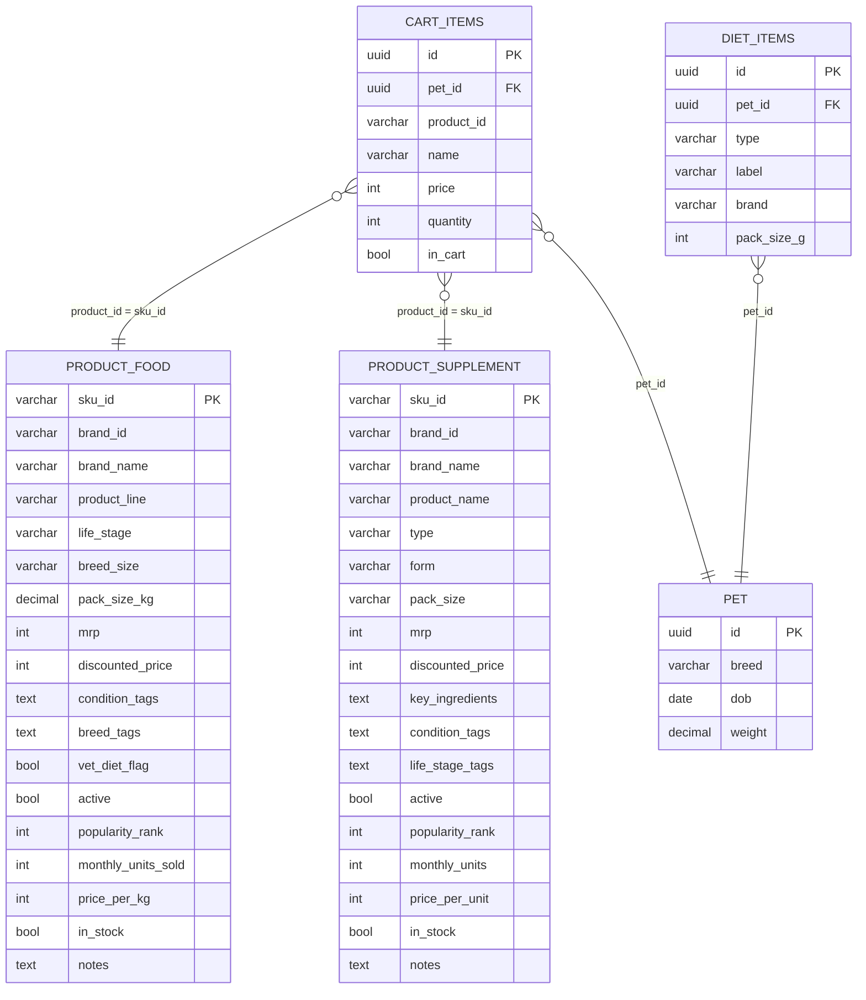
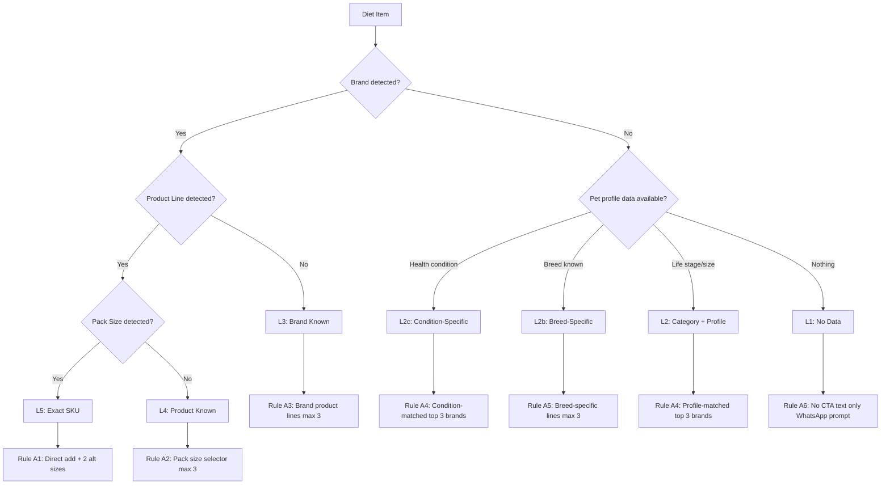

# Design: Cart Rules Engine

## Overview

The cart rules engine replaces PetCircle's basic product catalog and cart resolution with a signal-level system. The system detects how much it knows about a pet's diet/supplements (L5 exact SKU -> L1 no data) and resolves products accordingly. Two new product tables replace the monolithic `product_catalog`. A new `signal_resolver` service sits between the care plan and the cart, determining what products to show and how.

## Architecture



## Components and Interfaces

### 1. Signal Resolver Service (`backend/app/services/signal_resolver.py`)

New service -- the core of this feature. Pure deterministic logic, no AI.

```python
class SignalLevel(str, Enum):
    L5 = "L5"   # Exact SKU
    L4 = "L4"   # Product known, size unknown
    L3 = "L3"   # Brand/type known
    L2 = "L2"   # Category + profile
    L2B = "L2b" # Breed-specific
    L2C = "L2c" # Health condition specific
    L1 = "L1"   # No data

@dataclass
class SignalResult:
    level: SignalLevel
    products: list[dict]       # Resolved product options (max 3)
    cta_label: str | None      # "Order Now ->" or None for L1
    highlight_sku: str | None  # Pre-selected SKU (L5/L4)
    message: str | None        # Info prompt for L1

def resolve_food_signal(
    db: Session, 
    diet_item: DietItem, 
    pet: Pet, 
    conditions: list[Condition]
) -> SignalResult: ...

def resolve_supplement_signal(
    db: Session, 
    diet_item: DietItem, 
    pet: Pet
) -> SignalResult: ...
```

**Signal detection algorithm:**
1. Extract brand from `diet_item.label` and `diet_item.brand` -- fuzzy match against `product_food.brand_name` / `product_supplement.brand_name`
2. Extract product line -- match `diet_item.label` against `product_food.product_line` / `product_supplement.product_name`
3. Extract pack size -- parse `diet_item.detail` or `diet_item.pack_size_g` for numeric + unit
4. If brand + line + size -> L5. If brand + line -> L4. If brand only -> L3.
5. If no brand match, check pet profile: conditions -> L2c, breed -> L2b, life_stage/breed_size -> L2, else L1
6. For supplements: brand + type + size -> L5, brand + type -> L4, type only -> L3, generic -> L1

### 2. Product Models (`backend/app/models/`)

**`product_food.py`** -- replaces food category in old `product_catalog`:
```python
class ProductFood(Base):
    __tablename__ = "product_food"
    sku_id = Column(String(10), primary_key=True)      # F001, F002, ...
    brand_id = Column(String(10), nullable=False)       # BR01, BR02, ...
    brand_name = Column(String(100), nullable=False)
    product_line = Column(String(200), nullable=False)
    life_stage = Column(String(20), nullable=False)     # Puppy, Adult, All, Senior
    breed_size = Column(String(20), nullable=False)     # Small, Medium, Large, All
    pack_size_kg = Column(Numeric(5, 1), nullable=False)
    mrp = Column(Integer, nullable=False)
    discounted_price = Column(Integer, nullable=False)
    condition_tags = Column(Text, nullable=True)        # comma-separated
    breed_tags = Column(Text, nullable=True)            # comma-separated
    vet_diet_flag = Column(Boolean, nullable=False, default=False)
    active = Column(Boolean, nullable=False, default=True)
    popularity_rank = Column(Integer, nullable=False)
    monthly_units_sold = Column(Integer, nullable=True)
    price_per_kg = Column(Integer, nullable=True)
    in_stock = Column(Boolean, nullable=False, default=True)
    notes = Column(Text, nullable=True)
    created_at = Column(DateTime, default=datetime.utcnow)
```

**`product_supplement.py`**:
```python
class ProductSupplement(Base):
    __tablename__ = "product_supplement"
    sku_id = Column(String(10), primary_key=True)       # S001, S002, ...
    brand_id = Column(String(10), nullable=False)
    brand_name = Column(String(100), nullable=False)
    product_name = Column(String(200), nullable=False)
    type = Column(String(50), nullable=False)           # fish_oil, joint_supplement, etc.
    form = Column(String(30), nullable=False)           # liquid, chew, powder, paste, tablet
    pack_size = Column(String(50), nullable=False)      # "300 ml", "90 chews", etc.
    mrp = Column(Integer, nullable=False)
    discounted_price = Column(Integer, nullable=False)
    key_ingredients = Column(Text, nullable=True)
    condition_tags = Column(Text, nullable=True)
    life_stage_tags = Column(Text, nullable=True)       # comma-separated
    active = Column(Boolean, nullable=False, default=True)
    popularity_rank = Column(Integer, nullable=False)
    monthly_units = Column(Integer, nullable=True)
    price_per_unit = Column(Integer, nullable=True)
    in_stock = Column(Boolean, nullable=False, default=True)
    notes = Column(Text, nullable=True)
    created_at = Column(DateTime, default=datetime.utcnow)
```

### 3. Updated Cart Service (`backend/app/services/cart_service.py`)

Modifications to existing service:
- `toggle_cart_item()` -- resolve `product_id` against `product_food.sku_id` OR `product_supplement.sku_id` (instead of old `ProductCatalog.cart_item_id`)
- `add_to_cart()` -- accept `sku_id`, look up price from new tables
- New: `add_from_signal()` -- convenience method that takes a `SignalResult` and adds the highlighted product

### 4. Dashboard API Endpoints (`backend/app/routers/dashboard.py`)

New endpoint:
```
GET /dashboard/{token}/products/resolve?diet_item_id={uuid}
```
Returns:
```json
{
  "signal_level": "L4",
  "products": [
    {
      "sku_id": "F002",
      "brand_name": "Royal Canin",
      "product_line": "Hypoallergenic",
      "pack_size": "7 kg",
      "mrp": 4990,
      "discounted_price": 4490,
      "price_per_kg": 641,
      "in_stock": true,
      "vet_diet_flag": true,
      "is_highlighted": true
    }
  ],
  "cta_label": "Order Now ->",
  "message": null
}
```

New endpoint:
```
GET /dashboard/{token}/products/search?q={query}
```
Returns matching products from both tables, ranked by relevance. For Cart page search bar.

### 5. Frontend: Product Selector Card (`frontend/src/components/dashboard/ProductSelectorCard.tsx`)

New component -- renders as a bottom sheet / inline card:

```
+----------------------------------+
|  Select Product            [x]   |
|                                  |
|  * Royal Canin Hypoallergenic    |
|    7 kg  Rs.4,990  Rs.4,490     |
|    Rs.641/kg  * Most Popular     |
|                                  |
|  o Royal Canin Hypoallergenic    |
|    2 kg  Rs.1,690  Rs.1,520     |
|    Rs.760/kg                     |
|                                  |
|  o Royal Canin Hypoallergenic    |
|    14 kg  Rs.8,900  Rs.7,990    |
|    Rs.571/kg                     |
|                                  |
|  ! Therapeutic diet. Use under   |
|    veterinary guidance.          |
|                                  |
|  Qty: [ - ] 1 [ + ]             |
|                                  |
|  [Search more]  [Add to cart]    |
+----------------------------------+
```

Props: `products`, `signalLevel`, `onAddToCart`, `onClose`, `petWeight?`

### 6. Updated Care Plan Engine

`_resolve_diet_item_order_signals()` in `care_plan_engine.py` is replaced by a call to `signal_resolver.resolve_food_signal()` / `resolve_supplement_signal()`. The care plan response includes `signal_level` per diet item so the frontend knows whether to show "Order Now" CTA.

## Data Models



## Signal Level Decision Flowchart



## API Design

### New Endpoints

| Method | Path | Purpose | Response |
|--------|------|---------|----------|
| GET | `/dashboard/{token}/products/resolve` | Resolve products for a diet item | `SignalResult` JSON |
| GET | `/dashboard/{token}/products/search` | Search products by keyword | `Product[]` |
| POST | `/dashboard/{token}/cart/add` | Add resolved product to cart | `CartItem` |

### `GET /dashboard/{token}/products/resolve`

Query params: `diet_item_id` (UUID)

Response `200`:
```json
{
  "signal_level": "L4",
  "products": [
    {
      "sku_id": "F002",
      "category": "food",
      "brand_name": "Royal Canin",
      "product_line": "Hypoallergenic",
      "pack_size": "7 kg",
      "mrp": 4990,
      "discounted_price": 4490,
      "price_per_unit": 641,
      "unit_label": "per kg",
      "in_stock": true,
      "vet_diet_flag": true,
      "is_highlighted": true,
      "highlight_reason": "Most popular"
    }
  ],
  "cta_label": "Order Now ->",
  "vet_diet_warning": true,
  "pack_size_suggestion": "7 kg (~30 days for your pet)",
  "message": null
}
```

Response `200` for L1:
```json
{
  "signal_level": "L1",
  "products": [],
  "cta_label": null,
  "message": "Share your pet's food brand on WhatsApp so we can help you reorder."
}
```

### `POST /dashboard/{token}/cart/add`

Body:
```json
{
  "sku_id": "F002",
  "quantity": 1
}
```

Response `201`: `CartItem` serialized.

### `GET /dashboard/{token}/products/search?q=royal+canin`

Response `200`:
```json
{
  "results": [
    {
      "sku_id": "F001",
      "category": "food",
      "brand_name": "Royal Canin",
      "product_line": "Hypoallergenic",
      "pack_size": "2 kg",
      "discounted_price": 1520,
      "in_stock": true
    }
  ]
}
```

## Error Handling Strategy

| Scenario | Behavior |
|----------|----------|
| `diet_item_id` not found | 404 -- "Diet item not found" |
| No products match any level | Return L1 with empty products and info prompt |
| All matching products OOS | Show nearest in-stock alternative (C2) |
| Product table empty | Return L1 -- system degrades gracefully |
| Brand fuzzy match ambiguous | Prefer exact substring match; if none, demote to L2 |

## Testing Strategy

- **Unit tests** for signal resolver: one test per rule (A1-A6, B1-B4) with fixture data
- **Unit tests** for ranking/filtering: condition match, breed match, popularity sort, OOS filtering
- **Integration tests** for product resolution endpoint: seed DB, call API, verify response shape
- **Migration test**: verify old product_catalog dropped, new tables created, seed data correct
- **Frontend**: manual test of ProductSelectorCard with mock data at each signal level

## Security Architecture

No new attack surface. Existing token validation on all `/dashboard/{token}/` endpoints. Product data is public catalog info (no PII). Cart mutations go through existing `cart_service` with pet ownership checks.

| Threat | Vector | Mitigation |
|--------|--------|------------|
| Unauthorized cart access | Token guessing | Existing 128-bit random token validation |
| Price manipulation | Client-side price override | Price always read from DB server-side on add-to-cart |
| SQL injection via search | Search query param | Parameterized queries via SQLAlchemy ORM |

## Dependencies and Risks

| Risk | Impact | Mitigation |
|------|--------|------------|
| `diet_item.label` doesn't contain brand | Signal detection falls to L2/L1 | Existing `diet_item.brand` column provides backup |
| Brand name spelling variations | Failed L5/L4/L3 match | Case-insensitive + substring matching |
| Old product_catalog references in 12 files | Import errors after migration | Task 1 updates all imports |
| Cart items cleared on migration | Users lose in-progress carts | Acceptable -- cart_items are transient; communicate via release notes |

### ADR-1: Two Tables vs One Polymorphic Table

**Status:** Accepted
**Context:** Food and supplements have different fields (pack_size_kg vs form, condition_tags vs key_ingredients). The old `product_catalog` used one table with many nullable columns.
**Options:**
- Option A: Single `products` table with nullable columns -- Pro: simpler queries. Con: many nulls, unclear schema.
- Option B: Two tables `product_food` + `product_supplement` -- Pro: clean schema, typed fields, no nulls. Con: cart must check both tables.
**Decision:** Option B. The signal resolver already branches on food vs supplement, so checking the right table is natural. Clean schema is more important than query simplicity.
**Consequences:** `cart_service` must check both tables when resolving `sku_id`. Prefix convention (F/S) makes this deterministic.

### ADR-2: Deterministic Signal Resolution Over AI

**Status:** Accepted
**Context:** Current `recommendation_service.py` uses GPT to generate recommendations. The new rules are fully deterministic.
**Decision:** Signal resolver is pure Python, no AI. GPT-based recommendation service remains as fallback only when signal resolver returns L1 and we want to suggest something anyway.
**Consequences:** Faster, cheaper, predictable. AI recommendations preserved for cold-start edge cases.
