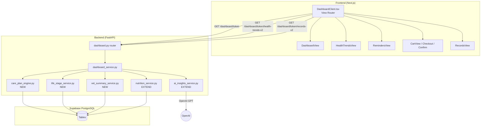
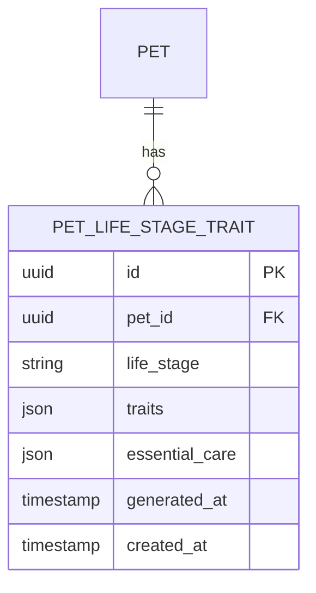

# Design: Dashboard Rebuild

## Overview

Rebuild the PetCircle dashboard from a 5-tab data management interface to a narrative-driven scrolling dashboard. The backend gains a Care Plan Classification Engine (`care_plan_engine.py`) and two new API endpoints. The frontend replaces tab navigation with view-switching across 5 pages (~20 new components). All changes are brownfield — conforming to existing FastAPI + SQLAlchemy patterns on the backend and Next.js + Tailwind on the frontend.

---

## Architecture



---

## Components and Interfaces

### Backend Services (New + Modified)

#### 1. `care_plan_engine.py` (NEW)

Core classification engine implementing the 7-step algorithm per test_type per pet.

```python
# Public interface
async def compute_care_plan(db: Session, pet: Pet) -> CarePlanV2:
    """Returns { continue: Section[], attend: Section[], add: Section[] }"""

# Internal steps
def _get_breed_size(weight_kg: float, breed: str) -> BreedSize  # 5 categories
def _get_life_stage(age_months: int, breed_size: BreedSize) -> LifeStage
def _get_baseline_protocol(life_stage: LifeStage, test_type: str) -> int  # days
def _filter_redundant_reports(reports: list[Report]) -> list[Report]
def _classify_test(reports: list[Report], baseline_days: int, prescription: Prescription | None) -> Classification
def _compute_next_due(classification: Classification, reports: list[Report], baseline_days: int) -> date | None
```

**Classification enum:**
```python
class Classification(str, Enum):
    NO_HISTORY = "no_history"           # → Suggested
    SINGLE = "single"                   # → Suggested
    SPORADIC = "sporadic"               # → Suggested
    PERIODIC = "periodic"               # → Continue
    PERIODIC_INSUFFICIENT = "periodic_insufficient"  # → Suggested
    PRESCRIPTION_ACTIVE = "prescription_active"      # → Attend To
```

**Breed size boundaries:**
```python
BREED_SIZE_BOUNDARIES = {
    "mini_toy": {"max_weight": 5, "adult_start": 24, "senior_start": 120},
    "small": {"max_weight": 10, "adult_start": 24, "senior_start": 108},
    "medium": {"max_weight": 25, "adult_start": 24, "senior_start": 96},
    "large": {"max_weight": 45, "adult_start": 24, "senior_start": 84},
    "extra_large": {"max_weight": 999, "adult_start": 24, "senior_start": 60},
}
```

**Baseline protocol (days between tests):**
```python
BASELINE_PROTOCOL = {
    # (life_stage, test_type) → interval_days
    ("puppy", "cbc_chemistry"): 56,     # 8wk intervals
    ("adult", "cbc_chemistry"): 730,    # every 2 years
    ("senior", "cbc_chemistry"): 365,   # annually
    ("adult", "chest_xray"): 1095,      # every 3 years
    ("senior", "chest_xray"): 365,      # annually
    # ... full matrix per spec Sheet 2+3
}
```

#### 2. `life_stage_service.py` (NEW)

Computes life stage data and generates/caches breed-specific traits.

```python
async def get_life_stage_data(db: Session, pet: Pet) -> LifeStageData:
    """Returns { stage, age_months, breed_size, traits[], essential_care[] }
    Traits: GPT-generated on first call, cached in pet_life_stage_traits table.
    Regenerated when life stage changes."""
```

#### 3. `vet_summary_service.py` (NEW)

Computes primary vet from contact mention frequency.

```python
async def get_vet_summary(db: Session, pet_id: UUID) -> VetSummary | None:
    """Queries contacts WHERE role='veterinarian', counts document_id references,
    returns the vet with the most mentions. Includes name + last visit date
    (derived from most recent document with that vet)."""
```

#### 4. `nutrition_service.py` (EXTEND)

Add method to format existing nutrition data as donut summaries.

```python
async def get_diet_summary(db: Session, pet: Pet) -> DietSummary:
    """Returns { macros: [{ label, pct, status, note }], missing_micros: [{ icon, name, reason }] }
    Uses existing nutrition analysis pipeline, formats for dashboard donuts.
    Applies guardrail thresholds: Calories >100%=amber, others >110%=amber/<80%=red,
    Omega-3 at 15%=RED."""
```

#### 5. `ai_insights_service.py` (EXTEND)

Add methods for care plan reasons and recognition bullets.

```python
async def generate_care_plan_reasons(db: Session, pet: Pet, orderable_items: list) -> dict[str, str]:
    """GPT-generates a reason for each orderable item connecting life stage + health + nutrition.
    Returns { item_id: reason_text }. Generated fresh each load (not cached)."""

async def generate_recognition_bullets(db: Session, pet: Pet) -> list[Bullet]:
    """Returns max 3 bullets summarizing what was found in reports.
    Order: conditions first, preventive second, diet last. Observational tone."""
```

#### 6. `health_trends_service.py` (NEW)

Assembles health trends data from existing diagnostic results, conditions, and preventive records.

```python
async def get_health_trends(db: Session, pet: Pet) -> HealthTrendsV2:
    """Returns { ask_vet, signals, cadence } assembled from existing DB data.
    ask_vet: per-condition cards with questions (GPT-generated, cached 7 days).
    signals: blood panel table, weight trend, metabolic tiles.
    cadence: vaccine/flea-tick/deworming timelines from preventive_records."""
```

#### 7. `records_service.py` (NEW)

Structures health records by type.

```python
async def get_records(db: Session, pet: Pet) -> RecordsV2:
    """Returns { vet_visits: [...], records: [...] }
    Queries documents table, groups by type, enriches with medications from conditions."""
```

### Frontend Components

#### View Router — `DashboardClient.tsx` (REWRITE)

```typescript
type ViewState = 'dashboard' | 'trends' | 'reminders' | 'cart' | 'checkout' | 'confirm' | 'records';

// State: view, dashboardData, cart[], loading, error, stale, isOnline
// Preserves: offline-first, stale data recovery, localStorage cache, auto-retry
// Removes: tab bar, visitedTabs, activeTab, showNudges, nudges state
```

#### Component Tree

```
DashboardClient (view router)
├── DashboardView (scrolling page)
│   ├── ProfileBanner
│   ├── RecognitionCard
│   ├── LifeStageCard
│   ├── HealthConditionsCard
│   ├── DietAnalysisCard (uses Donut)
│   ├── CarePlanCard
│   ├── HealthRecordsNav
│   └── CartFloater
├── HealthTrendsView (sticky header + scroll-synced tabs)
│   ├── AskVetSection
│   │   └── AskVetConditionCard (per condition)
│   ├── SignalsSection
│   │   ├── BloodPanelTable
│   │   ├── WeightTrendCard (uses LineChart)
│   │   └── MetabolicCard
│   └── CareCadenceSection
│       ├── VaccinationCadence (SVG timeline)
│       ├── TickFleaCadence (SVG dot-plot)
│       └── DewormingCadence (SVG timeline)
├── RemindersView
├── CartView → CheckoutView → ConfirmView
└── RecordsView
    └── VetVisitCard (collapsible)
```

#### Shared SVG Components

```
components/charts/
├── Donut.tsx          — SVG ring (64px), % center text, configurable color
├── LineChart.tsx       — Weight trend, N points, gradient fill, reference line
├── BarChart.tsx        — Pus cell bars, color-coded by threshold
├── TimelineSVG.tsx     — Vaccination/deworming node timeline
└── DotPlotSVG.tsx      — Tick & flea dose dot-plot with gap annotations
```

---

## Data Models

### New Tables



#### `pet_life_stage_traits` (NEW)

Caches GPT-generated life stage traits per pet.

| Column | Type | Constraints |
|--------|------|-------------|
| id | UUID | PK |
| pet_id | UUID | FK → pets(id) ON DELETE CASCADE |
| life_stage | VARCHAR(20) | NOT NULL (puppy/junior/adult/senior) |
| breed_size | VARCHAR(20) | NOT NULL |
| traits | JSONB | NOT NULL — `[{ label, color, order }]` |
| essential_care | JSONB | NOT NULL — `[{ icon, title, detail }]` |
| generated_at | TIMESTAMP | NOT NULL |
| created_at | TIMESTAMP | NOT NULL DEFAULT NOW() |

**Unique constraint:** `(pet_id, life_stage)` — one cache entry per life stage per pet. When life stage changes, delete old row and regenerate.

### Existing Tables Used (No Schema Changes)

- `contacts` — already has `role`, `name`, `document_id` for vet summary computation
- `preventive_records` — used by care plan engine for report history
- `diagnostic_test_results` — used by health trends for blood panel, pus cells
- `weight_history` — used by weight trend chart
- `conditions` + `condition_medications` + `condition_monitoring` — used by health conditions card and ask vet section
- `documents` — used by records view and recognition card (report count)
- `diet_items` + `food_nutrition_cache` + `nutrition_target_cache` — used by diet analysis
- `cart_items` + `product_catalog` — used by cart flow
- `pet_ai_insight` — used for cached ask-vet questions (existing 7-day cache)

---

## API Design

### Extended: `GET /dashboard/{token}`

**Response additions** (merged into existing `DashboardData`):

```typescript
interface DashboardDataV2 extends DashboardData {
  vet_summary: VetSummary | null;
  life_stage: LifeStageData;
  health_conditions_summary: HealthConditionSummary[];
  care_plan_v2: CarePlanV2;
  diet_summary: DietSummary;
  recognition: Recognition;
}

interface VetSummary {
  name: string;
  last_visit: string;  // ISO date
}

interface LifeStageData {
  stage: 'puppy' | 'junior' | 'adult' | 'senior';
  age_months: number;
  breed_size: 'mini_toy' | 'small' | 'medium' | 'large' | 'extra_large';
  traits: { label: string; color: 'green' | 'yellow' | 'red' | 'neutral' }[];
  essential_care: { icon: string; title: string; detail: string }[];
}

interface HealthConditionSummary {
  id: string;
  icon: string;
  title: string;
  severity: 'red' | 'yellow' | 'green';
  trend_label: string;
  insight: string;
}

interface CarePlanV2 {
  continue: CarePlanSection[];
  attend: CarePlanSection[];
  add: CarePlanSection[];
}

interface CarePlanSection {
  title: string;       // e.g., "💉 Vaccines & Preventive Care"
  header_color: string | null;
  items: CarePlanItem[];
}

interface CarePlanItem {
  id: string;
  name: string;
  freq: string;
  next_due: string;
  status: 'green' | 'yellow' | 'red';
  status_label: string;
  orderable: boolean;
  sku?: string;
  price?: number;
  icon?: string;
  reason?: string;     // GPT-generated, only for orderable items
}

interface DietSummary {
  macros: { label: string; pct: number; status: 'green' | 'amber' | 'red'; note: string }[];
  missing_micros: { icon: string; name: string; reason: string }[];
}

interface Recognition {
  report_count: number;
  bullets: { icon: string; label: string }[];
}
```

### New: `GET /dashboard/{token}/health-trends-v2`

```typescript
interface HealthTrendsV2 {
  ask_vet: AskVetData;
  signals: SignalsData;
  cadence: CadenceData;
}

interface AskVetData {
  vet_name: string;
  conditions: AskVetCondition[];
}

interface AskVetCondition {
  id: string;
  icon: string;
  label: string;
  label_color: string;
  headline: string;
  sub_highlight: string;
  sub_color: string;
  questions: string[];
  chart_data?: ChartData;     // pus cells bars or platelet line
  timeline_data?: TimelineData;
}

interface SignalsData {
  blood_panel: {
    label: string;
    date: string;
    headline: string;
    rows: { marker: string; range: string; value: string; status: 'Normal' | 'Low' | 'High' }[];
  } | null;
  weight: {
    points: { date: string; value: number }[];
    headline: string;
    recommendation: string;
  } | null;
  metabolic: {
    headline: string;
    sub: string;
    stats: { value: string; label: string }[];
  } | null;
}

interface CadenceData {
  vaccines: {
    headline: string;
    rounds: { id: string; label: string; vaccines: string; done: boolean }[];
    gaps: string[];
    footer: { text: string; color: string; bg: string };
  } | null;
  flea_tick: {
    headline: string;
    doses: { num: number | string; label: string; gap: string | null; status: string; gap_alert?: boolean }[];
    footer: { text: string; color: string; bg: string };
  } | null;
  deworming: {
    headline: string;
    doses: { label: string; done: boolean; now: boolean }[];
    footer: { text: string; color: string; bg: string };
  } | null;
}
```

### New: `GET /dashboard/{token}/records-v2`

```typescript
interface RecordsV2 {
  vet_visits: VetVisit[];
  records: RecordItem[];
}

interface VetVisit {
  id: string;
  title: string;
  date: string;
  tag: string;
  tag_color: string;
  tag_bg: string;
  rx_summary: string | null;
  medications: { name: string; dose: string; duration: string }[];
  notes: string | null;
}

interface RecordItem {
  id: string;
  icon: string;
  type: 'lab_report' | 'imaging' | 'whatsapp';
  title: string;
  date: string;
  tag: string;
  tag_color: string;
  tag_bg: string;
}
```

---

## Error Handling Strategy

| Scenario | Handling |
|----------|----------|
| Care plan engine fails | Return empty `care_plan_v2` with `{ continue: [], attend: [], add: [] }`. Log error. Dashboard still renders other cards. |
| GPT trait generation fails | Return empty traits/essential_care. Life stage bar still renders. Retry on next load. |
| GPT care plan reasons fail | Render orderable items without reason text. Log warning. |
| Health trends endpoint fails | Frontend shows "Unable to load trends" with retry button. Dashboard page unaffected. |
| Records endpoint fails | Frontend shows "Unable to load records" with retry button. Dashboard page unaffected. |
| No vet contacts found | `vet_summary: null`. Banner hides vet row gracefully. |
| No diagnostic data | Signals section shows "No lab results yet". Cadence shows "No data". |

All GPT calls wrapped in try/except. No GPT failure crashes the dashboard.

---

## Testing Strategy

| Layer | Approach |
|-------|----------|
| Care plan engine | Unit tests with fixture data covering all 7 classification paths + edge cases (redundant reports, prescriptions, boundary gaps) |
| Life stage service | Unit tests for breed size classification, life stage boundaries, trait caching |
| Vet summary service | Unit tests for mention counting, tie-breaking, no-contacts case |
| API endpoints | Integration tests hitting enriched dashboard, health-trends-v2, records-v2 |
| Frontend components | Visual review at 430px. Navigation flow testing (all 7 view transitions). Cart floater IntersectionObserver behavior. Scroll-sync on trends tabs. |

---

## Security Architecture

No new attack surface introduced. All new endpoints use existing `validate_dashboard_token()`. No new auth mechanisms.

| Threat | Mitigation |
|--------|-----------|
| GPT prompt injection via pet data | GPT prompts use system-level instructions with strict output format. Pet data passed as structured context, not raw user input. |
| Token enumeration on new endpoints | Same token validation + rate limiting as existing dashboard endpoint. |
| PII in GPT responses | Trait generation and care plan reasons use pet data only (no owner PII). |

---

## Scalability and Performance

| Concern | Approach |
|---------|---------|
| Care plan engine computation | Runs per dashboard load. ~10 test types × 7 steps = fast. No caching needed (data changes frequently). |
| GPT calls per load | Traits: cached in DB (1 call per life stage change). Reasons: 1 call per load (~3-5 orderable items in prompt). Ask-vet questions: cached 7 days (existing). Recognition: derivable from DB, no GPT needed. |
| Dashboard response size | Enriched response adds ~2-5KB. Trends and records on separate endpoints (lazy loaded on navigation). |
| selectinload | Already in use for dashboard queries. New services follow same pattern. |

---

## Dependencies and Risks

| Risk | Impact | Mitigation |
|------|--------|-----------|
| Care plan classification edge cases | Wrong bucket assignment | Comprehensive unit tests covering all 7 paths + redundancy guards |
| GPT trait quality varies | Poor/generic trait pills | System prompt specifies breed + age constraints. Cached — can be manually reviewed. |
| GPT reason generation latency | Slow dashboard load | Reason generation is last step; parallelize with other service calls via `asyncio.gather` |
| Large frontend rewrite | Regression risk | Old components kept until new ones verified. Incremental rollout by view. |
| Missing breed size data | Wrong life stage classification | Fallback to "medium" if breed/weight unavailable. Log warning. |

---

## ADR-1: Separate Endpoints for Trends and Records

**Status:** Accepted
**Context:** The dashboard, trends, and records views each need different data. Loading everything in one endpoint increases payload and latency.
**Options:**
- A: Single endpoint returns everything — simpler, but wasteful for initial dashboard load.
- B: Separate endpoints per view — more HTTP calls, but each page loads only what it needs.
**Decision:** Option B. `GET /dashboard/{token}` serves the main dashboard. `GET /dashboard/{token}/health-trends-v2` and `GET /dashboard/{token}/records-v2` are fetched on navigation.
**Consequences:** Frontend makes 1 request on load, additional requests only when user navigates. Slightly more backend routing code.

## ADR-2: GPT Reasons Generated Fresh vs Cached

**Status:** Accepted
**Context:** Care plan reason fields connect life stage + health + nutrition insights. This context changes frequently (new reports, weight changes).
**Decision:** Generate fresh on every dashboard load. The GPT call is a single prompt with 3-5 items — fast and cheap. Caching would risk stale reasons that don't match current data.
**Consequences:** ~0.5-1s added to dashboard load. Acceptable given the value of fresh, contextualized reasons.

## ADR-3: Single New DB Table Only

**Status:** Accepted
**Context:** The rebuild needs life stage traits cached. All other data (vet contacts, preventive records, diagnostics, etc.) already exists in the schema.
**Decision:** Add only `pet_life_stage_traits` table. Compute vet summary, care plan, diet summary, and recognition from existing tables at query time.
**Consequences:** Minimal migration. No schema bloat. Trade-off: slightly more computation per request, but data stays fresh.
