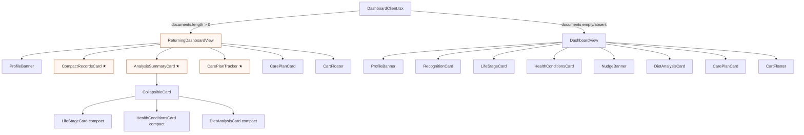

# Design: Returning Customer Dashboard

## Overview

This feature introduces a second dashboard layout for returning customers (those with uploaded documents). The implementation is entirely frontend — no backend changes, no new API calls, no data model changes. It adds 4 new components, modifies 4 existing ones, and wires a conditional render in `DashboardClient.tsx`.

---

## Architecture



★ = new component

---

## Components and Interfaces

### New Components

#### 1. `computeCarePlanCounts()` — utility function

**File:** `dashboard-utils.ts` (append after `itemStatusClass`)

```typescript
export function computeCarePlanCounts(
  data: DashboardData
): { onTrack: number; dueSoon: number; overdue: number } {
  const buckets = buildCarePlanBuckets(data);
  let onTrack = 0, dueSoon = 0, overdue = 0;

  for (const sections of Object.values(buckets)) {
    for (const section of sections) {
      for (const item of section.items) {
        const cls = itemStatusClass(item);
        if (cls === "s-tag-r") overdue++;
        else if (cls === "s-tag-y") dueSoon++;
        else onTrack++;
      }
    }
  }

  return { onTrack, dueSoon, overdue };
}
```

No new dependencies. Reuses existing `buildCarePlanBuckets` and `itemStatusClass`.

---

#### 2. `CompactRecordsCard.tsx`

**Props:**
```typescript
interface CompactRecordsCardProps {
  reportCount: number;
  onGoToRecords: () => void;
}
```

**Behavior:**
- Single-row card: left side "Organized Health Records" with report count badge, right side "View All" button
- Minimal vertical height — `padding: 10px 14px`
- Uses `.card` class for consistent border/radius

---

#### 3. `AnalysisSummaryCard.tsx`

**Props:**
```typescript
interface AnalysisSummaryCardProps {
  data: DashboardData;
  onGoToTrends: () => void;
}
```

**Behavior:**
- Wraps `CollapsibleCard` with title "Analysis", `defaultOpen={false}`
- Renders `LifeStageCard`, `HealthConditionsCard`, `DietAnalysisCard` inside, each with `compact={true}`
- When `compact={true}`, analysis cards suppress their outer `.card` `<div>` and render content directly

---

#### 4. `CarePlanTracker.tsx`

**Props:**
```typescript
interface CarePlanTrackerProps {
  petName: string;
  onTrack: number;
  dueSoon: number;
  overdue: number;
}
```

**Behavior:**
- Heading: "{petName}'s Care Plan"
- Three inline pills: green "X On Track", amber "Y Due Soon", red "Z Overdue"
- Hidden when all counts are zero (`if (onTrack + dueSoon + overdue === 0) return null`)
- Pill colors: green `#34C759`, amber `#FF9F1C`, red `#FF3B30` (consistent with existing status colors)

---

#### 5. `ReturningDashboardView.tsx`

**Props:** Same `DashboardViewProps` interface (imported from `DashboardView.tsx`).

**Behavior:**
- Renders: ProfileBanner → CompactRecordsCard → AnalysisSummaryCard → CarePlanTracker → CarePlanCard → CartFloater
- Duplicates cart animation logic from DashboardView (~30 lines: IntersectionObserver, addedIds state, timer cleanup)
- No NudgeBanner, no RecognitionCard, no HealthRecordsNav

### ADR-1: Duplicate vs Extract Cart Animation Logic

**Status:** Accepted
**Context:** Both `DashboardView` and `ReturningDashboardView` need identical cart animation logic (IntersectionObserver on `.order-btn`, addedIds flash state, timer cleanup). Options: (A) duplicate ~30 lines, (B) extract a shared custom hook.
**Options Considered:**
- Option A: Duplicate — Pro: zero refactoring of existing component, fastest to implement. Con: ~30 lines repeated.
- Option B: Extract hook `useCartAnimation` — Pro: DRY. Con: refactors working code, risk of regressions in existing view.
**Decision:** Duplicate (Option A). The logic is small, stable, and unlikely to diverge. Extracting a hook is a future refactor if a third layout is added.
**Consequences:** ~30 lines of repeated code across two files.

---

### Modified Components

#### `LifeStageCard.tsx`
- Add optional prop `compact?: boolean` to `LifeStageCardProps`
- When `compact={true}`: render content without the outer `<div className="card">` wrapper

#### `HealthConditionsCard.tsx`
- Add optional prop `compact?: boolean` to `HealthConditionsCardProps`
- When `compact={true}`: render content without the outer `<div className="card">` wrapper

#### `DietAnalysisCard.tsx`
- Add optional prop `compact?: boolean` to `DietAnalysisCardProps`
- When `compact={true}`: render content without the outer `<div className="card">` wrapper

#### `DashboardView.tsx`
- Remove `HealthRecordsNav` import and render (lines 12, 110-114)
- No other changes

#### `DashboardClient.tsx`
- Import `ReturningDashboardView`
- In `renderView()` `case "dashboard"`: check `(data.documents?.length ?? 0) > 0`
- If true, render `<ReturningDashboardView>` with same props
- If false, render existing `<DashboardView>`

---

## Data Models

No data model changes. All data comes from the existing `DashboardData` type already fetched by `fetchDashboard()`.

---

## API Design

No API changes. No new endpoints.

---

## Error Handling Strategy

- `computeCarePlanCounts()` handles missing `care_plan_v2` gracefully via `buildCarePlanBuckets` (returns empty buckets)
- `CompactRecordsCard` receives `reportCount` as a prop — fallback computed in parent: `data.recognition?.report_count ?? data.documents?.length ?? 0`
- If `documents` is undefined/null, the `?? 0` fallback in the length check ensures first-time layout renders

---

## Testing Strategy

Manual verification (no unit test framework currently configured for frontend):
1. Load dashboard with token for pet WITH documents → returning layout
2. Load dashboard with token for pet WITHOUT documents → first-time layout
3. Tap "View All" on CompactRecordsCard → navigates to Records
4. Tap Analysis chevron → expands to show 3 cards
5. Verify tracker pill counts match care plan item statuses
6. Add item to cart → CartFloater appears and works
7. `npm run build` passes

---

## Security Architecture

No security implications. No new data exposure, no new endpoints, no auth changes. All data already accessible via the existing token-validated dashboard API.

---

## Scalability and Performance

- `computeCarePlanCounts()` iterates all care plan items — same data already iterated by `buildCarePlanBuckets()`. Negligible cost.
- No additional API calls or re-renders
- CollapsibleCard defers child rendering until expanded (existing behavior)

---

## Dependencies and Risks

| Risk | Likelihood | Impact | Mitigation |
|------|-----------|--------|------------|
| `compact` prop breaks existing card rendering | Low | Medium | Prop defaults to `false`; existing call sites unaffected |
| Cart animation diverges between views | Low | Low | Duplicated from working code; future extract if needed |
| `documents` field missing on older API responses | Low | Low | Guarded with `?.length ?? 0` — defaults to first-time layout |
